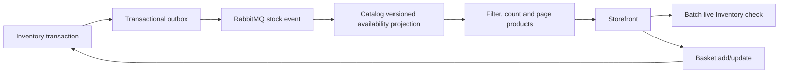

# Catalog availability

Catalog and basket now expose current stock so customers can see whether a product is available before checkout. Adding an item that cannot be purchased returns a clear add-to-bag error.

## Store behavior

- Listings default to products with positive projected availability. `includeOutOfStock=true` includes unavailable products; the matching checkbox resets pagination. Availability filtering runs before counting, sorting and paging.
- Cards obtain current Inventory quantities with one bounded batch read for the visible page. Unknown/failed stock reads and sold-out items disable Add to bag. Stock labels distinguish in-stock, low stock and out of stock. Existing bag quantities count toward the available/99-unit limit; the shopper can follow Review your bag.
- Product details remain addressable for sold-out products, with a disabled purchase action. Add failures describe inability to add; update failures describe how to fix an existing bag.
- The bag does not reserve stock. Inventory remains authoritative at add/update/checkout and during its locked reservation. An item can sell out after a page loads; the card then disables purchase, and the next catalog refresh removes it from the default list.

This storefront policy follows the availability options documented by [Amazon Creators API SearchItems](https://partnernet.amazon.de/creatorsapi/docs/en-us/api-reference/operations/search-items), which defaults to available items and supports IncludeOutOfStock. This is a reference for this project's behavior, not a claim that every Amazon retail page behaves identically. ShopSphere does not accept backorders or invent a restock date.

## Ownership and synchronization

Inventory owns quantities, reservations and the monotonic stock version. Catalog owns products and a derived `ProductAvailability` query table; it never connects to Inventory's database. This follows the [Microsoft microservice data guidance](https://learn.microsoft.com/azure/architecture/microservices/design/data-considerations) on event-maintained materialized views.



Reserve, release and commit changes publish availability/version in the same existing outbox transaction as stock. Catalog's consumer applies only a strictly newer version, so duplicate or delayed events cannot restore stale availability.

At startup and every ten minutes, Catalog reconciles Inventory snapshots through a private HTTP endpoint with keyset pagination, at most 2,000 rows per response. Versioned bulk UPSERTs preserve newer concurrent events. The first pass gates product listing with HTTP 503 until ready; a failed pass retries after ten seconds.

The query projection is eventually consistent. Current card reads, backend checks and the final locked reservation cover competing purchases; filtering is not a stock guarantee. Permanent Inventory deletion is outside the existing app's scope and would require tombstone events/reconciliation before adding such an operation.

## Contracts and checks

- `GET /api/products`: default available-only; `includeOutOfStock=true` opts in to all products. Page items add nullable `availableQuantity`; a missing projection is unknown and excluded by default. Detail metadata keeps its existing contract.
- `GET /api/inventory/availability?ids=<comma-separated GUIDs>`: at most 100 IDs; returns current sellable quantity, zero for missing stock. Invalid/oversized input returns HTTP 400. Gateway read limits remain enabled.
- `GET /internal/availability?after=<GUID>&limit=2000`: private Inventory snapshot for reconciliation, not routed by Gateway.
- Catalog migrations add the projection/inbox/outbox tables and name/price indexes. Inventory migration adds version with default zero without changing available/reserved quantities.

With the Compose stack running, verify projection event ordering with:

```powershell
node scripts/verify-availability-projection.mjs
```

The check sends isolated stock events through RabbitMQ, verifies that newer versions apply and delayed or repeated versions are ignored, then removes its temporary projection row. It does not modify product records, stock, baskets, orders, or payments.
